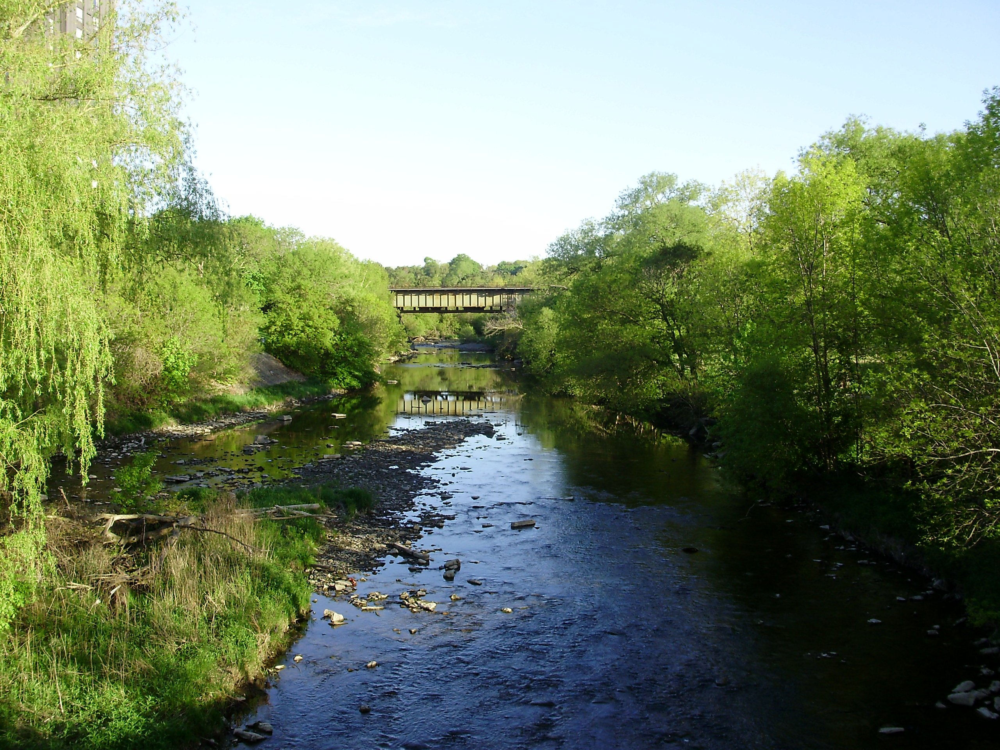

# Greater-Toronto-Area-Watershed-Analysis-Test-1. Just a test. Trying to upload my first html rmd onto the internet. Any and all critiques welcome. 
---
title: "Assessing the biotic communities in rivers across the Greater Toronto Area, ON, Canada"
Author: "Andrew Mao"
date: "Last compiled on `r format(Sys.time(), '%d %B, %Y')`"
output: 
 prettydoc::html_pretty:
  theme: architect
  toc: true
  number_sections: true
  toc_depth: 2
---
<style>
    body { background-color: white; }
    pre, pre:not([class]) { background-color: white; }
</style>


<button type="button"><a href="https://rpubs.com/ChhaaBaiGuy">Homepage</button><a/>

</center>

# Introduction

As per previous investigations (Bazinet et al 2010), there is evidence to suggest that the increasing urbanization in the Greater Toronto Area correlates with a decrease in biotic community population and diversity across affected lotic systems. Therefore, as part of this investigation, a thorough analysis of watersheds extending from Etobicoke to Ajax was conducted and subsequently, assessed in conjunction with the previous results and surveys (Wallace et al 2013).

```{r Loading, echo = FALSE, message= FALSE }
library(tidyverse)
library(ggplot2)
library(readr)
library(SciViews)
library(lubridate) 
library(vegan)
library(ggpubr)
library(gghighlight)
#loading datasets and necessary packages
#Data from the TRCA’s Regional Watershed Monitoring Program
Counts_2013 <- read_csv("rwmp-benthic-macroinvertebrate-data-2013-2020.csv") #Loading data and tools, Using data from Toronto Regional and Conservation Authority
#Note that the stats all use Kick and Sweep Method and 100+ fixed count method and thus, are removed from stats for simplicity
#also removing site name 
Counts <- Counts_2013[,-c(1,3:4, 19:20)]
```
First, we establish the datasets we will be using, of which we have many. Data from the Toronto Regional Council Authority website has open access data as far back as 2013 for our intended purposes. With this, we have completed an detailed analysis of Macroinvertebrate diversity with a focus on sensitive taxa as well as potential environmental stressors including temperature and dissolved oxygen using the appropriate reference guides and methodologies where possible. The analysis techniques used in this analysis were derived from previously utilized methods from past reports in order to maintain relative comparability. Following, a brief discussion regarding the results of current and past trends is provided. Finally, a conclusion to round out how to improve the watersheds, if necessary will be brought to attention.

As per the data that was taken from the Toronto and Region Greater Conservation Authority, figure 1 shows the testing sites across the Toronto region for the data taken.


</center>

# Macroinvertebrate Counts

Using the data over the period 2013-2020, Shannon-Wiener index will be used to determine the diversity of macroinvertebrate communities in the GTA Region.

$$
H = -\sum_{i = 1}^{S}{P_iln(P_i)}
$$
<span style="color: grey;">_Figure 2. Shannon-Weiner Index for the surveyed creeks in the Greater Toronto Area, 2013 - 2020_</span>


H =  Shannon diversity index
S =  Number of Species Present 
P = proportion (n/N) of individuals of a species (n) found divided by the total number of individuals found (N)
ln = Natural Log
E = Summation of the following equation

```{r Invertebrate Data part 1, echo = FALSE}
Counts <- Counts[,-c(2:5,7:9,11,14,15)]  #cleaning unnecessary columns 
Counts <- Counts %>% group_by(Watershed, `Collection Date`) %>% mutate(Prop = `Total Count`/sum(`Total Count`)) #Calculating P 
Counts <- Counts %>% group_by(Watershed, `Collection Date`) %>% mutate(lnProp = (ln(Prop))) #Calculating natural log
Counts <- Counts %>% group_by(Watershed, `Collection Date`) %>% mutate(PLP = Prop*lnProp) #Multiplying the proportions by natural log of the proportions
Counts <- Counts %>% group_by(Watershed, `Collection Date`) %>% mutate(Shannon_final = abs(sum(PLP))) #summarizing the shannon values by  watershed and then absolute valuing it 
ggplot(Counts, aes(`Collection Date`, Shannon_final)) + geom_point()  + facet_wrap(~ Watershed) + geom_smooth(method = lm, col = 'red') #Dotplot to show the diversity of invertebrates within each of the watersheds across the GTA
##This one is even cleaner
Counts %>% group_by(`Watershed`, `Collection Date`) %>% summarise(Shannon = diversity(`Total Count`)) -> Test
ggplot(Test, aes(`Collection Date`, Shannon)) + geom_point() + facet_wrap(~Watershed) + geom_smooth(method = lm, col = 'red')
```

<span style="color: grey;">_Figure 3. Scatterplots depicting Shannon-Wiener Index across tested watersheds in the GTA during the period 2013-2020. NB:The higher the number, the more diverse the community._

As seen here, a variety of trends can be depicted across different systems in the GTA. From here, the most definitive conclusion we can draw from this is that there are upward trends towards higher diversity in macroinvertebrates within such systems. However, a single graph is not enough to satisfy any questions. For instance, we have not looked into the query if less tolerant taxa such as tricoptera, plecoptera and ephemeroptera (Thorne et al 2000).


## Sensitive Taxa

```{r Sensitive taxa, echo = FALSE}
#Counting the number of sensitive taxa (Mayfly, Stonefly, Caddisfly)
subset(Counts, grepl("Mayfly", `Common Name`)) -> Mayfly #Found em i think
subset(Counts, grepl("Stonefly",`Common Name`)) -> Stonefly
subset(Counts, grepl("Caddisfly", `Common Name`)) -> Caddisfly
rbind(Mayfly, Caddisfly, Stonefly) -> End
End %>% group_by(Watershed, `Collection Date`) %>% summarise("Total Sum" = sum(`Total Count`)) %>% ggplot(aes(`Collection Date`, `Total Sum`)) + facet_wrap(~Watershed) + geom_jitter()
```

<span style="color: grey;">_Figure 4. Scatterplot for distribution and abundance of sensitive taxa, tricoptera, plecoptera and ephemeroptera_</span>

As alluded to by various sources, whilst some river systems display varying abundances of the EPT taxa total population, systems such as Carruthers Creek, Frenchman's Bay and Petticoat Creek show significantly lower population or near absent populations. Because these taxa are particularly sensitive to temperature changes, (Needs a reference). In addition, these systems are located primarily in Pickering and Ajax in the Durham Region. There may be some correlation between the locations and their current management or perhaps their proximity to the Pickering Nuclear Generating Power Plants.

Whilst overt trends are not so present in the data, potential trends may be more present in environmental data. Therefore, a thorough data analysis of such is also conducted at the following sites in figure 2. In accordance with Qu et al 2005 and Jiang et al 2010, Elevation and levels of silicon dioxide are primary factors determining macroinvertebrate populations. Hence, it is worth looking into here. Other studies have shown a more likely negative relationship between urbanization effects such as increased chemical input into such systems and a decrease in macroinvertebrate populations, which is more likely case for watersheds in our area of study (Wallace et al 2013).

Whilst there are numerous variables that can be found within the dataset, for the sake of simplicity, zinc, temperature and conductivity will be calculated and compared across the streams. 

# Dissolved Oxygen

With benthic macroinvertebrates, dissolved oxygen is of the utmost importance for such organisms. It serves as an indicator for the presence of benthic macrophytes and the lack thereof can serve as a warning that can give rise to algal blooms (Ogbeibu and Oribhabor 2002). Thus, such a parameter is very important to look at in terms of our it may affect communities across the GTA. 

```{r dissolved oxygen}
#Loading data from csv files
read.csv("2015-wq-data-from-database-no-project-sites.csv") -> Data2015
read.csv("2016-wq-data-from-database-no-project-sites.csv") -> Data2016
read.csv("trca-2017-wq-data-rwmp-sites.csv") -> Data2017
read.csv("trca-2018-wq-data-rwmp-sites.csv") -> Data2018
read.csv("trca-2019-wq-data-rwmp-sites.csv") -> Data2019
read.csv("2020-wq-data-from-database-no-project-sites-1.csv") -> Data2020
#Extracting Dissolved Oxygen Data and removing uneccessary columns
Data2015[,c(5,10:12,13, 15:16)] %>% filter(ParameterDefinitionName == "Oxygen, Dissolved") -> DO15
Data2016[,c(5,10:12,13, 15:16)] %>% filter(ParameterDefinitionName == "Oxygen, Dissolved") -> DO16
Data2017[,c(3,8:11, 13:14)] %>% filter(ParameterDefinitionName == "Oxygen, Dissolved") -> DO17
Data2018[,c(5,10:12,13, 15:16)] %>% filter(ParameterDefinitionName == "Oxygen, Dissolved") -> DO18
Data2019[,c(5,10:12,13, 15:16)] %>% filter(ParameterDefinitionName == "Oxygen, Dissolved") -> DO19
Data2020[,c(5,10:12,13, 15:16)] %>% filter(ParameterDefinitionName == "Oxygen, Dissolved") -> DO20
#Coagulating all the data together
rbind(DO15,DO16, DO17, DO18, DO19, DO20) -> DO
#Graphing it
ggplot(DO) + geom_jitter(aes(Year, FinalValue))  + gghighlight(FinalValue < 6.5) + facet_wrap(~Watershed) + ylim(0,15)
```

<span style="color: grey;">_Figure 5. Scatterplot for dissolved oxygen (DO) values across the GTA over the period 2015-2020. Data highlighted indicates below expected DO values (< 6.5mg/L). 
 

```{r chems - Electrical Conductivity, echo = FALSE}
#loading heaps of data
Data2015[,c(5,10:12,13, 15:16)] %>% filter(ParameterDefinitionName == "Conductivity, Specific (Field)") -> CON15
Data2016[,c(5,10:12,13, 15:16)] %>% filter(ParameterDefinitionName == "Conductivity, Specific (Field)") -> CON16
Data2017[,c(3,8:11,13:14)] %>% filter(ParameterDefinitionName == "Conductivity, Specific (Field)") -> CON17
Data2018[,c(5,10:12,13, 15:16)] %>% filter(ParameterDefinitionName == "Conductivity, Specific (Field)") -> CON18
Data2019[,c(5,10:12,13, 15:16)] %>% filter(ParameterDefinitionName == "Conductivity, Specific (Field)") -> CON19
Data2020[,c(5,10:12,13, 15:16)] %>% filter(ParameterDefinitionName == "Conductivity, Specific (Field)") -> CON20
rbind(CON15, CON16, CON17) -> CON #combining it all together
rbind(CON18, CON, CON19, CON20) -> CON
CON %>% arrange(Year) -> CON #sorting out by year
CON %>% ggplot(aes(Year, FinalValue)) + geom_jitter() + facet_wrap(~Watershed) + xlab("Year") + ylab("Microsiemens (uS/cm)") + ggtitle(label = "Figure 4A", )  #jitter plot for Conductivity 
CON %>% ggplot(aes(Year, FinalValue)) + geom_jitter() + facet_wrap(~Watershed) + xlab("Year") + ylab("Microsiemens (uS/cm)") + geom_smooth(method = lm) +ylim(500,25000) + ggtitle(label = "Figure 4B", )  #jitter plot to show all results above 1000uS/cm which is above acceptable reference levels. #Also, zero still present. how to get it out
```

<span style="color: grey;">_Figure 5a and b. a) displays a electrical conductivity surveys across watersheds in the Greater Toronto Area. b) shows all watersheds with results that exceed the reference levels for Ontario (500 uS/cm)._</span>


As electrical conductivity serves as an indicator for both dissolved metals as well as salinity in watersheds, it is important to look at such a metric. In accordance with the Environmental Protection Agency (EPA, 2012), ideal electrical conductivity reference levels are between 0-500 uS/cm. In that regard, half of all the tests show values greater than that. This is particularly apparent for Don River, Etobicoke Creek and Humber where these values are regularly exceeded.

# Zinc Levels

```{r chems - Zinc, echo = FALSE}
#Starting with E. coli
Data2015 %>% filter(ParameterDefinitionName == "Zinc, Total") -> ZN2015 #Filtering data
Data2016 %>% filter(ParameterDefinitionName == "Zinc, Total") -> ZN2016
Data2017 %>% filter(ParameterDefinitionName == "Zinc, Total") -> ZN2017
Data2018 %>% filter(ParameterDefinitionName == "Zinc, Total") -> ZN2018
Data2019 %>% filter(ParameterDefinitionName == "Zinc, Total") -> ZN2019
Data2020 %>% filter(ParameterDefinitionName == "Zinc, Total") -> ZN2020
ZN2015[,-c(1:4,6:9,13:14,17:22)] -> ZN2015 #eliminating unnecessary data
ZN2016[,-c(1:4,6:9,13:14,17:22)] -> ZN2016
ZN2017[,-c(1:2,4:7,11:12,15:19)] -> ZN2017
ZN2018[,-c(1:4,6:9, 13:14,17:22)] -> ZN2018
ZN2019[,-c(1:4,6:9, 13:14,17:22)] -> ZN2019
ZN2020[,-c(1:4,6:9,13:14,17:25)] -> ZN2020
rbind(ZN2015, ZN2016, ZN2017) -> ZN #combining it all together
rbind(ZN2018, ZN, ZN2019, ZN2020) -> ZN
ZN %>% ggplot(aes(Year, FinalValue)) + geom_jitter() + facet_wrap(~Watershed) + xlab("Year") + ylab("µg/L") #jitter plot for zinc
```

<span style="color: grey;">_Figure 6. Zinc concentrations for watersheds in the Greater Toronto Area._</span>
 

Heavy metals such as zinc have the potential to bioaccumulate in macroinvertebrates. In some cases, levels of trace metals found in surveyed organisms are equivalent to those found in nearby substrate (Goodyear and McNeil, 1999). Hence, Zinc levels in the water have been assessed accordingly. Going off surface water concentration guidelines set out by the Canadian Water Quality Guidelines for the Protection of Aquatic Life (2018), acceptable concentrations seem to sit between <2 to 537ug/L. Hence, trace amounts are expected to occur in any given waterbodies. 

In terms of the results seen in figure 5, there are no surveys which detected results above the reference levels set by the Ontarian government. However, as a final litmus test of sorts, the annual temperature divided by seasons will provide an indicator as to how viable some of these environments are for macroinvertebrates. The more sensitive taxa will be privy to temperature changes in the water and hence, higher temperatures will likely indicate shifts in their respective environments.

# Temperature

```{r chems - Temperature, echo = FALSE}
#Loading temperature data
read.csv("rwmp_watertemperature_data_2014.csv") -> Temp_2014
Temp_2014[,-c(1:7,12:19,24:26)] -> Temp_2014
Temp_2014 %>% group_by(Watershed, Month_Number, Day_Number) %>% summarise(n_temp = mean(Obs_Value)) -> Temp_2014 
#Need to do for the rest of the years
Year <- c(rep(2014))
#2015
read.csv("rwmp_watertemperature_data_2015.csv") -> Temp_2015
Temp_2015[,-c(1:7,11:17,23:25)] -> Temp_2015
Temp_2015[,-c(2:3)] -> Temp_2015
Temp_2015 %>% group_by(Watershed, Month_Number, Day_Number) %>% summarise(n_temp = mean(Obs_Value)) -> Temp_2015
#2016
read.csv("rwmp_watertemperature_data_2016.csv") -> Temp_2016
Temp_2016[,-c(1:7,9:17,23:25)] -> Temp_2016
Temp_2016 %>% group_by(Watershed, Month_Number, Day_Number) %>% summarise(n_temp = mean(Obs_Value)) -> Temp_2016
#2017
read.csv("rwmp_watertemperature_data_2017.csv") -> Temp_2017
Temp_2017[,-c(1:7,9:17,23:25)] -> Temp_2017
Temp_2017 %>% group_by(Watershed, Month_Number, Day_Number) %>% summarise(n_temp = mean(Obs_Value)) -> Temp_2017
#2018
read.csv("rwmp_watertemperature_data_2018_a.csv") -> Temp_2018a
Temp_2018a[,-c(1:7,9:17,23:25)] -> Temp_2018a
Temp_2018a %>%  group_by(Watershed, Month_Number, Day_Number) %>% summarise(n_temp = mean(Obs_Value)) -> Temp_2018a
read.csv("rwmp_watertemperature_data_2018_b.csv") -> Temp_2018b
Temp_2018b[,-c(1:7,9:17,23:25)] -> Temp_2018b
Temp_2018b %>% rename(Watershed = Humber, Timetag = X2018.05.31.23.00.00.000, Year_Number = X2018, Month_Number = X5, Day_Number = X31, Obs_Value = X19.912) -> Temp_2018b
Temp_2018b %>%  group_by(Watershed, Month_Number, Day_Number) %>% summarise(n_temp = mean(Obs_Value)) -> Temp_2018b
read.csv("rwmp_watertemperature_data_2018_c.csv") -> Temp_2018c
Temp_2018c %>% rename(Watershed = Rouge, Timetag = X2018.08.25.00.15.00.000, Year_Number = X2018, Month_Number = X8, Day_Number = X25, Obs_Value = X21.378) -> Temp_2018c
Temp_2018c  %>%  group_by(Watershed, Month_Number, Day_Number) %>% summarise(n_temp = mean(Obs_Value)) -> Temp_2018c
rbind(Temp_2018a, Temp_2018b, Temp_2018c) -> Temp_2018
#Altogether
Temp_2014 %>% mutate(Year = 2014) -> Temp_2014
Temp_2015 %>% mutate(Year = 2015) -> Temp_2015
Temp_2016 %>% mutate(Year = 2016) -> Temp_2016
Temp_2017 %>% mutate(Year = 2017) -> Temp_2017
Temp_2018 %>% mutate(Year = 2018) -> Temp_2018
rbind(Temp_2014, Temp_2015, Temp_2016, Temp_2017, Temp_2018) -> Temp_Full
#Trying something new
Temp_2014 %>% group_by(Watershed, Month_Number) %>% summarise(N = mean(n_temp)) -> Simp2014
Temp_2015 %>% group_by(Watershed, Month_Number) %>% summarise(N = mean(n_temp)) -> Simp2015
Temp_2016 %>% group_by(Watershed, Month_Number) %>% summarise(N = mean(n_temp)) -> Simp2016
Temp_2017 %>% group_by(Watershed, Month_Number) %>% summarise(N = mean(n_temp)) -> Simp2017
Temp_2018 %>% group_by(Watershed, Month_Number) %>% summarise(N = mean(n_temp)) -> Simp2018
#Cleaner graph with lines and no dodgy stuff
ggplot(Simp2014, aes(Month_Number,N)) + geom_line(aes(colour = "2014")) + geom_line(data = Simp2015, aes(color = "2015")) + labs(color = "Year") + geom_line(data = Simp2016, aes(color = "2016")) + geom_line(data = Simp2017, aes(color = "2017")) + geom_line(data = Simp2018, aes(color = "2018")) + facet_wrap(~Watershed)

```

<span style="color: grey;">_Figure 7. Temperature changes over the period 2014-2018 in watersheds across the Greater Toronto Area._</span>
 

Temperature changes over the period seem to show an increase over the period 2014-2018. However, this alone is not enough to determine if such trends indicate loss in biodiversity. Taken from Chu et al 2009 and Stoneman and Jones (1996), taking the maximum air temperature for the months June to August and correlating that with the average temperature of the water within each respective watershed. Across the watersheds, a number of them display peak values that exceed the reference values stated in figure 7. This is perhaps cause for concern although the maximum temperature values are not entirely overwhelming. Such values are only exceeded by a single degree in most cases. However, this does not mean it is not something that will not require surveillance in the future. 

```{r constructing the damn graph from Stoneman and Jones (1996)}
#constructing the data frames necessary. Values taken approximately from original figure
a <- c(15.8, 18.1) 
b <- c(20.2, 26.1)
c <- c(24.2, 30)
z <- c(24.5, 35) #base for the polygon in geom_area
Coldwater <- cbind(z, a) %>% data.frame()  #Taking each data set, transforming it into a data frame and binding it to the z co-ordinate to form a polygon within the graph
Coolwater <- cbind(z, b) %>% data.frame() 
Warmwater <- cbind(z, c) %>% data.frame() 
plot <- ggplot() + geom_area(data = Warmwater, aes(z, c, fill = "Warmwater"))+ geom_area(data = Coolwater, aes(z, b, fill = "Coolwater")) + geom_area(data = Coldwater, aes(z, a, fill = "Coldwater"))  + xlab("Maximum Air Temperature (°C)") + ylab("Water Temperature at 1600 hours (°C)") #plotting it all out now. Just need to adjust the y and x axis for discrete variables
plot +  coord_cartesian(ylim = c(10, 30), expand = FALSE) #Setting limits
```

 <span style="color: grey;">_Figure 8. Temperature Range for Cold, Cool and Warmwater fish in correspondence to mean air temperatures taken at 1600 hours (Recreated from Stoneman and jones 1996.)._</span>

# Conclusion

Whilst macroinvertebrate communities show a wide variety of diverse taxa, the effects of urbanized streams becomes more apparent when certain watersheds show a lack of sensitive taxa as well as increasing temperatures and high levels of electrical conductivity. In order to tackle these problems, a number of solutions can be implemented which when compounded can reduce the effects of urban development on these systems. Riparian plantings can provide much needed shade as well as filtering out heavy metals travelling in soil. Additionally, for the most degraded environments, more active volunteering efforts to clean the perimeter of their respective watersheds such as Don River, Etobicoke and Humber will greatly benefit the ecology of the area. 

References:

Bazinet, N. L., Gilbert, B. M., & Wallace, A. M. (2010). A comparison of urbanization effects on stream benthic macroinvertebrates and water chemistry in an urban and an urbanizing basin in Southern Ontario, Canada. Water Quality Research Journal, 45(3), 327-341.

Canadian Water Quality Guidelines for the Protection of Aquatic Life. (2018). Accessed April 8 2022 from https://ccme.ca/en/res/zinc-en-canadian-water-quality-guidelines-for-the-protection-of-aquatic-life.pdf.

Chu, C., Jones, N. E., Piggott, A. R., & Buttle, J. M. (2009). Evaluation of a simple method to classify the thermal characteristics of streams using a nomogram of daily maximum air and water temperatures. North American Journal of Fisheries Management, 29(6), 1605-1619.

Environment and Natural Resources Canada. (Date Unknown). https://www.enr.gov.nt.ca/sites/enr/files/conductivity.pdf.

Environmental Protection Agency. EPA (2012). Accessed April 9 2022 from https://archive.epa.gov/water/archive/web/html/vms59.html.

Goodyear, K. L., & McNeill, S. (1999). Bioaccumulation of heavy metals by aquatic macro-invertebrates of different feeding guilds: a review. Science of the Total Environment, 229(1-2), 1-19.

Jiang, X. M., Xiong, J., Qiu, J. W., Wu, J. M., Wang, J. W., & Xie, Z. C. (2010). Structure of macroinvertebrate communities in relation to environmental variables in a subtropical Asian river system. International Review of Hydrobiology, 95(1), 42-57.

Ontario Ministry for the Environment. (2012). Accessed March 20 2022 from https://www.ontario.ca/document/water-quality-15-streams-agricultural-watersheds-southwestern-ontario-2004-2009#section-5.

Qu, X., Tang, T., Xie, Z., Ye, L., Li, D., & Cai, Q. (2005). Distribution of the macroinvertebrate communities in the Xiangxi River system and relationships with environmental factors. Journal of Freshwater Ecology, 20(2), 233-238.

Stoneman, C. L., & Jones, M. L. (1996). A simple method to classify stream thermal stability with single observations of daily maximum water and air temperatures. North American Journal of Fisheries Management, 16(4), 728-737.

Thorne, R. S. J., Williams, W. P., & Gordon, C. (2000). The macroinvertebrates of a polluted stream in Ghana. Journal of Freshwater Ecology, 15(2), 209-217.

Toronto Regional Conservation Authority. (2021).Retrieved February 27 2022 from https://data.trca.ca/dataset?q=TRCA%E2%80%99s+Regional+Watershed+Monitoring+Program.

Wallace, A. M., Croft-White, M. V., & Moryk, J. (2013). Are Toronto’s streams sick? A look at the fish and benthic invertebrate communities in the Toronto region in relation to the urban stream syndrome. Environmental monitoring and assessment, 185(9), 7857-7875.

<button type="button"><a href="https://rpubs.com/ChhaaBaiGuy">Homepage</button><a/>
